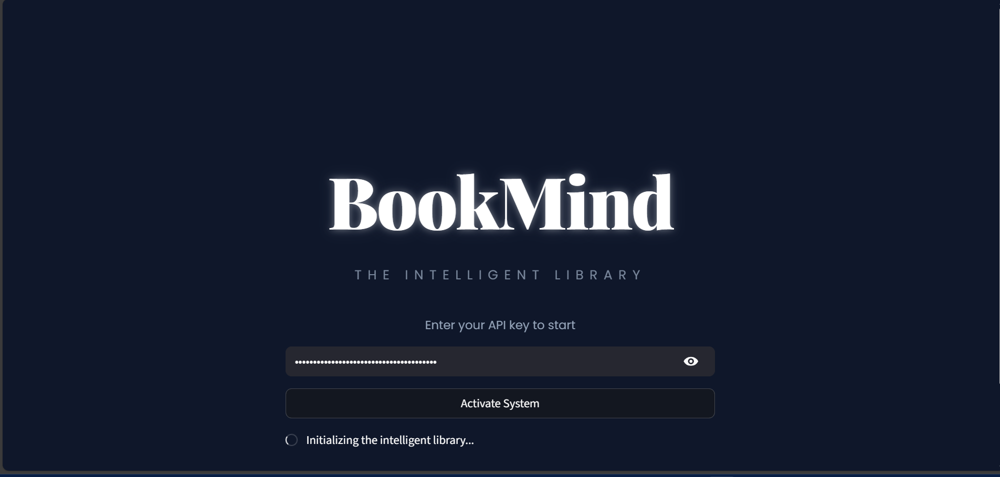

#  BookMind AI: Advanced Semantic Library Assistant

**BookMind** is a high-end book recommendation engine that bridges the gap between traditional library catalogs and modern AI. It leverages **Semantic Vector Search** and **Large Language Models (LLMs)** to provide intuitive, context-aware book suggestions through a sophisticated, glowing user interface.

---

##  Why BookMind?
Traditional search relies on keyword matching. **BookMind** understands intent. Whether you're looking for "a dark mystery about lost memories" or "an inspiring biography of a scientist," the system identifies the core themes and emotions to find the perfect match.

##  Key Features
- **Semantic Vector Search:** Powered by `FAISS` and `Sentence-Transformers` for near-instant similarity matching.
- **LLM Reasoning:** Integrates **Google Gemini 1.5 Flash** to explain *why* specific books were recommended.
- **Hybrid Bilingual Support:** Architected to handle both Arabic and English datasets and queries seamlessly.
- **Premium UI/UX:** A custom-designed **Glowing Signature Edition** interface built with Streamlit and advanced CSS.
- **Clean Code Architecture:** Modular Python design following industry standards (Configuration, Processing, and Engine separation).

---

##  Technical Architecture

### 1. Data Engineering (`data_processor.py`)
- Advanced cleaning of book genres and descriptions.
- Dynamic text-profile generation for high-accuracy embedding.

### 2. The Vector Engine (`vector_engine.py`)
- **Embeddings:** Uses `paraphrase-multilingual-MiniLM-L12-v2` to map text into 384-dimensional vectors.
- **Indexing:** Implements `FAISS` (Facebook AI Similarity Search) for optimized Euclidean distance calculations.

### 3. Generative AI Layer (`app.py`)
- Context-Injection: Relevant book metadata is fed into **Gemini 1.5** to generate personalized, conversational responses.

---

---

##  Data Handling & Flexibility
To ensure scalability and handle large-scale datasets efficiently, **BookMind** is designed with a "Plug-and-Play" data architecture:

- **Large Dataset Support:** The system is optimized to process extensive CSV files (like the Global Library Dataset) without performance lags.
- **Custom User Data:** Users can easily integrate their own library datasets. By simply placing their CSV file in the project directory and updating the `DATA_FILE` path in `config.py`, the engine will automatically:
    1. Clean the new data.
    2. Re-generate the Vector Embeddings.
    3. Update the FAISS index for immediate search.
- **Efficient Indexing:** To avoid redundant processing, the system saves the mathematical "Index" locally (`faiss_index.bin`). This allows the library to load in seconds after the first initialization.

*Data Customization Note*

Note: To keep the repository lightweight, the primary dataset is not included. BookMind is designed to be data-agnostic; you can bring your own literary dataset! Simply place your CSV file in the root directory as Global_Library_Dataset.csv. On the first run, the system will dynamically analyze your data, generate new multilingual embeddings, and build a custom FAISS search index tailored to your specific collection.

---

## 📸 Interface Preview

| 1. API Activation | 2. Intelligent Search |
| :---: | :---: |
|  |  |   |
| *Secure Gateway for API Key* | *Context-Aware Recommendations* |

| 3. Visual Identity & Theme |
| :---: |
|  |
| *The Glowing Signature Edition UI* |

---

